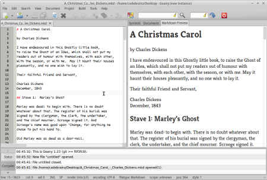

# Geany Markdown Preview（增强版）

[English summary](#english-summary) at the end of this file.

Geany 编辑器的 Markdown 实时预览插件，fork 自 [geany-plugins](https://github.com/geany/geany-plugins) 2.1 官方 `markdown` 插件并深度增强：**离线数学/物理/化学公式渲染**（MathJax / KaTeX 双引擎）、**Geany 配色方案实时同步**、**GFM 管道表格**、**编辑器缩放跟随**、**HTML 导出**（手机/平板/微信浏览器友好）。



```markdown
## 热传导方程
$$\frac{\partial u}{\partial t} = \alpha \nabla^2 u + \frac{1}{c}\dv{q}{t}$$

 inline：质能方程 $E = mc^2$；化学：$\ce{2H2 + O2 -> 2H2O}$
```

边打字边渲染，公式、表格、代码高亮全部**离线**完成，无任何 CDN 依赖。

---

## 目录

- [特性总览](#特性总览)
- [编译与安装](#编译与安装)
- [公式渲染详解](#公式渲染详解)
- [GFM 管道表格](#gfm-管道表格)
- [配色方案同步](#配色方案同步)
- [缩放跟随](#缩放跟随)
- [导出 HTML](#导出-html)
- [配置参考](#配置参考)
- [模板系统](#模板系统)
- [架构说明（开发者向）](#架构说明开发者向)
- [二次开发扩展指南](#二次开发扩展指南)
- [与上游 geany-plugins 2.1 的差异](#与上游-geany-plugins-21-的差异)
- [测试](#测试)
- [许可证与致谢](#许可证与致谢)

---

## 特性总览

| 特性 | 说明 |
|---|---|
| 实时预览 | 文档 filetype 为 Markdown 时自动渲染，随打字更新（idle 去抖） |
| 公式渲染 | LaTeX 语法；`$...$` `$$...$$` `\(...\)` `\[...\]` 四种定界符；MathJax 3.2.2 / KaTeX 0.18.7 双引擎，离线资源随插件安装 |
| 物理宏包 | MathJax 完整 `physics` 宏包；KaTeX 内置常用宏 shim（`\dv` `\pdv` `\qty` `\abs` …） |
| 化学方程式 | 双引擎均支持 `mhchem`（`\ce{...}`） |
| GFM 表格 | 管道表格、列对齐（`:---` `:---:` `---:`）、单元格内粗体/代码/链接/公式、`\|` 转义 |
| 配色同步 | 预览跟随 Geany 当前配色方案（正文/选区/代码块/表格），切换主题即时刷新 |
| 缩放跟随 | 编辑器 `Ctrl++` / `Ctrl+-` / `Ctrl+0` 同步缩放预览，重渲染后保持 |
| HTML 导出 | 工具菜单一键导出，自带响应式标记，手机/iPad/微信浏览器阅读友好 |
| 视图位置 | 预览可放侧边栏或底部消息窗口，偏好设置即改即生效 |
| 模板系统 | 自定义 HTML 模板 + `@@占位符@@` 替换，旧模板自动补齐响应式/表格 CSS |

---

## 编译与安装

### 依赖

- Geany ≥ 2.0（本仓库在 Geany 2.1 上开发与测试）
- GTK3、GLib、WebKitGTK 4.1（`webkit2gtk-4.1` pkg-config 模块）
- C 编译器（GCC / Clang）、`pkg-config`、GNU make

Debian/Ubuntu 安装依赖：

```bash
sudo apt install libgeany-dev libgtk-3-dev libwebkit2gtk-4.1-dev \
                 pkg-config build-essential
```

### 独立构建（推荐）

```bash
git clone https://github.com/yikuide-lab/geany-markdown.git
cd geany-markdown
make            # 构建 markdown.so + 单元测试
make test       # 运行 math 模块单元测试（65 项断言）
sudo make install
```

默认安装位置（可通过变量覆盖，见 Makefile 头部注释）：

| 内容 | 位置 |
|---|---|
| `markdown.so` | `$(geany libdir)/geany/`，如 `/usr/lib/x86_64-linux-gnu/geany/` |
| 离线公式资源 | `/usr/share/geany-plugins/markdown/math/` |
| 帮助文档 | `/usr/share/doc/geany-plugins/markdown/html/` |

### 在 geany-plugins 树内构建

`src/`、`math/`、`peg-markdown/`、`docs/` 目录与 geany-plugins 2.1 的
autotools 结构保持兼容，可直接替换官方树中的 `markdown/` 目录后
`./configure && make -C markdown && sudo make -C markdown install`。

### 启用

重启 Geany → **工具 → 插件管理器** → 勾选 **Markdown**。新建/打开
`.md` 文件，预览出现在侧边栏（默认）或消息窗口。

> 注意：插件使用了 `plugin_module_make_resident`，升级后需**重启 Geany**
> 才能加载新版本。

---

## 公式渲染详解

### 定界符

| 写法 | 类型 | 示例 |
|---|---|---|
| `$...$` | 行内公式 | `$E = mc^2$` |
| `\(...\)` | 行内公式（等价写法） | `\(a_i + b_i\)` |
| `$$...$$` | 块级公式（可跨行） | `$$\int_0^1 x\,dx$$` |
| `\[...\]` | 块级公式（等价写法） | `\[\dv{y}{x}\]` |

所有公式在 **Markdown 解析之前**被提取为不透明占位符（详见
[架构说明](#架构说明开发者向)），因此公式内的 `_`、`*`、`&`、`|`
永远不会被 Markdown 语法破坏——`$a*b_c$`、表格单元格里的 `$|x|$`
都能正确渲染。

### 防误判规则

为避免把普通文本误认成公式，提取器（`src/math.c`）实现了以下保护：

- **代码保护**：围栏代码块（```` ``` ```` / `~~~`）、4 空格或 tab
  缩进的代码块、行内代码 span 内的内容一律不提取；
- **围栏隔离**：块级公式的闭合定界符扫描遇到代码围栏即终止，
  未闭合的 `$$` 不会吞掉文档其余部分；
- **货币保护**：`$5 and $10`、`$5-$10` 等价格文本不被提取
  （`$...$` 内容首尾不能是空白，且必须含字母 / `\` / `^` / `_` /
  `{` / `}` / `=` 等"像公式"的字符）；
- **转义保护**：`\$` 表示字面美元符；`\\(` 不会被当作公式开头；
- **防碰撞**：占位符含每次提取随机生成的 nonce，用户文档中恰好
  出现的 `mdmathI0` 字样不会与真实占位符冲突。

### 物理与化学

```markdown
物理（MathJax 完整 physics 宏包）：
  \(\dv{y}{x}\) \(\pdv[2]{f}{x}\) \(\qty{9.81}{m/s^2}\) \(\abs{x}\)

化学（mhchem，双引擎支持）：
  \(\ce{2H2 + O2 -> 2H2O}\)
  \(\ce{CO2 + C ->[高温] 2CO}\)
```

KaTeX 没有官方 physics 宏包，插件在 `math_build_assets()` 中内置了
常用宏 shim：`\dv` `\pdv` `\pd` `\qty` `\unit` `\va` `\vb` `\vu`
`\abs` `\avg` `\comm`。

### 引擎对比

| | MathJax（默认） | KaTeX |
|---|---|---|
| 速度 | 较慢 | 快 |
| physics 宏包 | 完整支持 | 内置 shim |
| mhchem 化学 | ✔ | ✔ |
| 切换方式 | 偏好对话框 → *Math Engine* | 同左 |

资源缺失时（如 `NO_MATH=1` 安装）自动降级为纯文本公式，不报错。

### 已知限制

- 列表项**内部**的块级公式（`$$...$$`）会打断列表结构——占位符方案
  的固有限制，列表内请优先使用行内公式；
- `$1+1$` 这类纯数字算式因货币保护规则不会被渲染（加字母或 `^`/`=`
  即可，如 `$1+1=2$` 正常渲染）。

---

## GFM 管道表格

```markdown
| 对象     |   定义   | 可否建模 |
|----------|:--------:|---------:|
| 价格 $P_t$ | **非平稳** | ❌ |
| 对数收益  | 弱平稳    | ✅ |
```

- 表头行与分隔行单元格数量必须一致，否则整块按普通文本处理；
- 对齐标记：`:---` 左、`:---:` 居中、---:` 右（默认左）；
- `\|` 转义后留在当前单元格内；
- 公式先于表格解析提取，`$|x|$` 不会切断单元格；
- 表格样式（边框、斑马纹、表头底色）自动注入旧模板。

表格支持由本仓库扩展的 peg-markdown 解析器实现
（`peg-markdown/markdown_parser.leg`）。

## 配色方案同步

默认开启：预览正文/文字颜色、选区高亮、代码块底色、表格边框全部取自
Geany 当前配色方案（**视图 → 配色方案** 切换后自动重渲染，无需重启）。

实现方式：Geany 没有主题切换信号，插件在 `SCN_PAINTED` 通知上计算
配色指纹（方案名 + 默认样式前景/背景哈希），指纹变化即触发刷新。

不想要主题同步时，在偏好对话框取消勾选 *Use current Geany color
scheme*，改用手动 *BG Color* / *FG Color*。链接色按背景亮度自动选择
深浅两档蓝色，保证暗色方案下可读。

## 缩放跟随

编辑器 `Ctrl++` / `Ctrl+-` / `Ctrl+0`（或 Ctrl+滚轮）缩放时，预览按
`（基准字号 + 缩放点数）/ 基准字号` 同步缩放；WebView 每次重载会重置
缩放，插件在 `WEBKIT_LOAD_FINISHED` 后自动恢复。缩放是文档级属性，
切换文档时同样跟随。

## 导出 HTML

**工具 → Export Markdown as HTML...** 将当前预览（含公式、表格、
响应式标记）保存为独立 HTML 文件。导出文件内置：

- UTF-8 `charset` 与移动端 `viewport` 元标记；
- 自适应 CSS：图片/视频随屏宽缩放、宽表格横向滚动（< 800px）、
  禁用 iOS/微信浏览器字号膨胀。

直接发给手机、iPad 或在微信里打开均可正常阅读。公式引擎脚本以
`file://` 绝对路径引用本机安装的离线资源——**本机**打开即可渲染，
发给他人时如需公式，请一并分发或改用在线 CDN 模板。

---

## 配置参考

偏好对话框（插件管理器 → Preferences）与配置文件
`~/.config/geany/plugins/markdown/markdown.conf` 双向对应：

| 配置键 | 类型 / 默认值 | 说明 |
|---|---|---|
| `[general] template` | 字符串 / 空 | HTML 模板文件路径；空则用 `~/.config/geany/plugins/markdown/template.html`（首次运行自动生成） |
| `[view] position` | 0 / 1（侧边栏） | 预览位置：侧边栏或消息窗口 |
| `[view] font_name` | Serif | 正文字体 |
| `[view] code_font_name` | Monospace | 代码字体 |
| `[view] font_point_size` | 12 | 正文字号（pt） |
| `[view] code_font_point_size` | 12 | 代码字号（pt） |
| `[view] bg_color` / `fg_color` | #fff / #000 | 手动背景/前景色（配色同步开启时忽略） |
| `[view] scheme_colors` | true | 跟随 Geany 配色方案 |
| `[math] enabled` | true | 启用公式渲染 |
| `[math] engine` | mathjax | 渲染引擎：`mathjax` 或 `katex` |

修改模板文件路径后**立即生效**（无需重启 Geany）。

## 模板系统

模板中的占位符在每次渲染时替换：

| 占位符 | 替换为 |
|---|---|
| `@@markdown@@` | 渲染后的 HTML 正文 |
| `@@font_name@@` / `@@code_font_name@@` | 字体名（自动加引号） |
| `@@font_point_size@@` / `@@code_font_point_size@@` | 字号 |
| `@@bg_color@@` / `@@fg_color@@` | 手动颜色（配色同步时为空） |
| `@@math_assets@@` | 公式引擎 `<link>`/`<script>` 块 |

兼容性：没有 `@@math_assets@@` 占位符的旧模板自动把公式脚本注入到
`</head>` 前；缺 `viewport`/`charset`/响应式 CSS/表格 CSS 的旧模板也会
被自动补齐。

---

## 架构说明（开发者向）

### 渲染管线

```
Scintilla 编辑器
   │ SCN_MODIFIED（文本变更）/ 文档切换 / 配色指纹变化 / SCN_ZOOM
   ▼
plugin.c: update_markdown_viewer()
   │ 拉取全文 + 文档编码
   ▼
viewer.c: markdown_viewer_get_html()
   │
   ├─ math.c: math_extract()        ← 公式先于解析提取
   │     $...$ → `mdmathI<idx><nonce>`（代码 span 包裹）
   │     $$...$$ → mdmathD<idx><nonce>（独立段落）
   │
   ├─ peg-markdown: markdown_to_string()   ← Markdown → HTML
   │
   ├─ viewer.c: template_replace()  ← 套模板 + 配色 CSS + 引擎资源
   │
   └─ math.c: math_restore()        ← 占位符 → HTML 转义后的 TeX
   ▼
WebKitGtk: load_html()（保持滚动位置与缩放级别）
```

公式最终以 `<span class="math-inline">\(...\)</span>` /
`<div class="math-display">\[...\]</div>` 形式进入页面，由引擎脚本
（MathJax `tex-chtml-full.js` 或 KaTeX auto-render）排版。

### 文件职责

| 文件 | 职责 |
|---|---|
| `src/plugin.c` | 插件入口、Geany 信号接线、配色指纹、缩放同步、导出对话框 |
| `src/viewer.c` | `MarkdownViewer`（WebKitWebView 子类）、渲染编排、滚动/缩放保持 |
| `src/math.c` | 公式提取/还原/引擎资源生成——纯 GLib 无 GTK 依赖，可独立测试 |
| `src/conf.c` | `MarkdownConfig`（GKeyFile 持久化）、偏好 GUI、配色 CSS 生成 |
| `src/markdown-gtk-compat.c` | GtkTable/GtkGrid 等 GTK3 兼容垫片 |
| `src/test-math.c` | `math.c` 单元测试（21 用例 / 65 断言） |
| `peg-markdown/` | GPL 友好的 Markdown 解析器（PEG 语法，含 GFM 表格扩展） |
| `math/` | 离线渲染资源（MathJax 3.2.2 / KaTeX 0.18.7，见 `math/README`） |

---

## 二次开发扩展指南

### 运行测试

```bash
make test        # math 模块 21 个用例
```

`math.c` 是纯函数模块（输入字符串 → 输出字符串 + 段数组），不依赖
GTK/WebKit，加用例只需在 `src/test-math.c` 写函数并加进 `main()`。

### 新增渲染引擎

1. 在 `math_build_assets()`（`src/math.c`）加一个 `g_strcmp0(engine,
   "xxx") == 0` 分支：校验资源完整性（参考 `have_file()` 用法），拼接
   引擎的 `<script>`/`<style>` 块；
2. 引擎需支持 `\(...\)` / `\[...\]` 定界符（`math_restore()` 的输出
   格式），或在该分支里把定界符配置成引擎原生格式；
3. `src/conf.c` 的 `PROP_MATH_ENGINE` getter 与偏好对话框下拉框
   （`markdown_config_gui()`）各加一个选项。

### 新增模板占位符

1. `src/conf.c`：`markdown_config_get_property()` 读键 → 新属性；
2. `src/viewer.c`：`template_replace()` 里 `g_object_get()` 取值后
   `replace_all(tmpl, "@@new_key@@", value)`；
3. 默认模板 `MARKDOWN_HTML_TEMPLATE`（`src/conf.c`）同步加上占位符，
   并考虑旧模板的注入回退。

### 新增配置项

在 `src/conf.c` 按现有模式加四处：属性枚举 + `g_param_spec_*` +
`set_property`（写 keyfile）+ `get_property`（读 keyfile）；偏好 GUI
在 `markdown_config_gui()` 与 `on_dialog_response()` 各加一行。
配置对象任何属性变化都会触发预览刷新（`notify` 信号已接线）。

### 修改 Markdown 解析器

语法在 `peg-markdown/markdown_parser.leg`（PEG 语法）。重新生成
`markdown_parser.c` 需要 `leg` 工具（上游 peg-0.1.9，本仓库未包含，
生成文件已随仓库提交，日常改 `.c` 层即可）。

### 调试

`G_MESSAGES_DEBUG=Markdown geany 2>&1 | grep Markdown` 可看到资源
缺失、模板读取失败等 `g_debug` 输出。

---

## 与上游 geany-plugins 2.1 的差异

上游 `markdown` 插件（作者 Matthew Brush）提供基础的实时预览。
本仓库新增（详见 [CHANGELOG.md](CHANGELOG.md)）：

- `src/math.c` + `math/` 离线资源：公式提取/还原与双引擎渲染；
- 配色方案同步（指纹检测 + CSS 生成）；
- 缩放跟随与重渲染后缩放恢复；
- 工具菜单 HTML 导出；
- 旧模板响应式/表格 CSS 自动注入；
- peg-markdown 扩展：GFM 管道表格；
- 一轮代码评审修复：定界符围栏感知、缩进代码块保护、占位符 nonce、
  货币误判启发式、模板热重载、资源完整性校验、内存/引用小修。

上游的所有原始版权与 GPL-2.0 许可证完整保留。

## 测试

```bash
make test
```

覆盖：四种定界符提取、代码块（围栏/缩进/tab/行内）保护、围栏不被
`$$` 吞噬、货币/价格误判、转义、化学公式、占位符还原往返、防碰撞、
引擎资源生成与注入。

## 许可证与致谢

- 插件代码：**GPL-2.0-or-later**，基于 Matthew Brush 的 geany-plugins
  markdown 插件（见 `AUTHORS`、`COPYING`）；
- MathJax 3.2.2：Apache-2.0（`math/mathjax/LICENSE`）；
- KaTeX 0.18.7：MIT（`math/katex/LICENSE`）；
- peg-markdown 解析器：MIT / GPL 兼容（`peg-markdown/README`）。

---

## English summary

An enhanced fork of the geany-plugins 2.1 *markdown* plugin for Geany:
real-time preview with **offline math/physics/chemistry formula
rendering** (MathJax 3.2.2 or KaTeX 0.18.7, both bundled), live Geany
color-scheme sync, GFM pipe tables, editor zoom tracking, responsive
HTML export, and a template system with auto-injection for legacy
templates. Formulas are extracted **before** Markdown parsing and
restored after templating, so `_`/`*`/`&`/`|` inside math are never
mangled. Build: `make && sudo make install` (needs Geany ≥ 2.0, GTK3,
webkit2gtk-4.1). Tests: `make test`. GPL-2.0-or-later.
