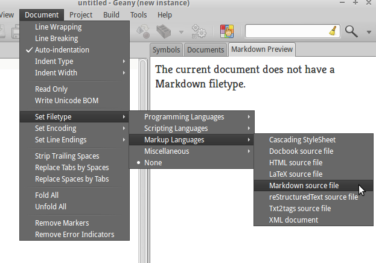
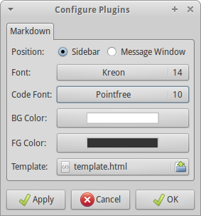
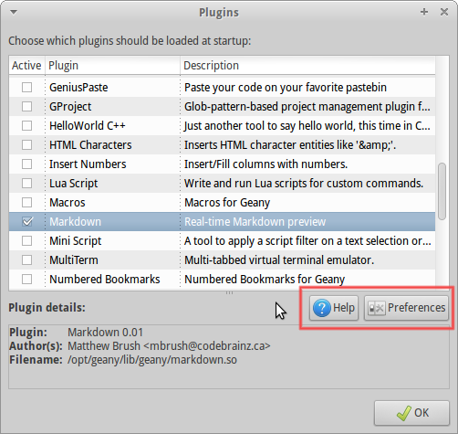
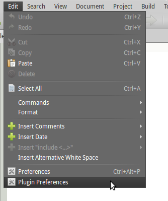

Markdown
========

.. image:: plugin_small.png
   :align: center
   :alt: The Markdown plugin in action
   :target: plugin.png

.. contents::

About
-----

This plugin provides a real-time preview of rendered Markdown, that is,
`Markdown <http://daringfireball.net/projects/markdown>`_ converted to HTML
and inserted into an HTML template and loaded into a
`WebKit <http://www.webkit.org>`_ view.

Features
--------

* Allows placing the preview in the sidebar or message window areas
* Updates the preview on-the-fly as you type, automatically.
* Allows simple customization of fonts and colours and complete control
  with custom template files.
* Follows the current Geany color scheme by default (including live
  updates when you switch View → Color Schemes).
* Renders GitHub-Flavored (GFM) pipe tables with alignment and inline
  markup in cells.
* Renders math, physics and chemistry formulas offline (MathJax or
  KaTeX, both bundled with the plugin).
* Follows the editor zoom: View → Zoom In/Out (typically ``Ctrl++`` /
  ``Ctrl+-``) scales the preview together with the editor.
* Responsive preview and export: UTF-8 charset, mobile/tablet viewport
  and adaptive CSS, so exported HTML reads well in phone browsers,
  iPad and the WeChat browser (images scale, tables scroll sideways).

Usage
-----

The preview is active by default for all documents with a Markdown filetype
set. To set a document's filetype, choose from the menus:

Other than that the operation should be fully automatic. Use the Plugin
Preferences mechanism to customize some settings as described below.

For more information on Markdown syntax, read the
`Markdown Syntax Documentation
<http://daringfireball.net/projects/markdown/syntax>`_.

*Tables (GFM pipe tables)*
^^^^^^^^^^^^^^^^^^^^^^^^^^^

GitHub-Flavored pipe tables are supported, including column alignment
and inline markup (bold, code, links, formulas) in cells::

    | 对象 | 定义 | 可否建模 |
    |---|:---:|---:|
    | 价格 $P_t$ | **非平稳** | ❌ |
    | 对数收益 | 弱平稳 | ✅ |

* Header and delimiter rows must have the same number of cells;
  otherwise the block is not treated as a table.
* Alignment markers: ``:---`` (left), ``:---:`` (center), ``---:``
  (right).
* Escaped pipes (``\|``) stay inside the current cell.
* Formulas are extracted *before* table parsing, so ``$|x|$`` never
  splits a cell.
* Styling follows the preview color scheme (table CSS is injected
  automatically for older templates).

*Color scheme*
^^^^^^^^^^^^^^

By default the preview uses the colors of the currently selected Geany
color scheme (View → Color Schemes): body background/foreground,
text selection, code backgrounds and table chrome.  Switching the
scheme re-renders the preview automatically.  Uncheck *Use current
Geany color scheme* in the plugin preferences to fall back to the
manual *BG Color* / *FG Color* settings.

*Zoom*
^^^^^^

Use View → Zoom In / Zoom Reset / Zoom Out (default keybindings
``Ctrl++``, ``Ctrl+0``, ``Ctrl+-``) or ``Ctrl`` + mouse wheel in the
editor.  The preview scales by the same factor, computed from the
editor's zoom in points relative to the configured body font size.
The zoom level is restored after each preview re-render and follows
document switches.

*Mobile / tablet / WeChat browsers*
^^^^^^^^^^^^^^^^^^^^^^^^^^^^^^^^^^^

The default HTML template includes a UTF-8 ``charset`` meta tag, a
responsive ``viewport`` meta tag and adaptive CSS: images and videos
scale to the screen width, wide tables scroll horizontally below
800&nbsp;px, and iOS/WeChat text-size inflation is disabled.  The same
markup is written by **Tools → Export Markdown as HTML**, so exported
files render correctly when opened on a phone, iPad or in the WeChat
browser.  Older custom templates without these tags get the meta tags
and a ``md-responsive-css`` block injected automatically before
``</head>``.

*Formulas (math / physics / chemistry)*
^^^^^^^^^^^^^^^^^^^^^^^^^^^^^^^^^^^^^^^

The preview renders LaTeX-style formulas in real time.  The following
delimiters are recognized (they are extracted *before* Markdown parsing,
so ``_``, ``*`` and ``&`` inside formulas are never mangled):

=========================  =================================================
Syntax                     Meaning
=========================  =================================================
``$E = mc^2$``             Inline math
``\(a_i + b_i\)``          Inline math (alternative delimiter)
``$$\int_0^1 x\,dx$$``     Display (block) math
``\[\dv{y}{x}\]``          Display math (alternative delimiter)
=========================  =================================================

* Math: any LaTeX formula, e.g. ``$\frac{\partial u}{\partial t} = \alpha \nabla^2 u$``
* Physics: with the default MathJax engine the full ``physics`` macro
  package works, e.g. ``\(\dv{y}{x}\)``, ``\(\pdv{f}{x}\)``,
  ``\(\qty{9.81}{m/s^2}\)``.  The KaTeX engine ships a shim covering the
  most common physics macros.
* Chemistry: the ``mhchem`` package is available on both engines, e.g.
  ``\(\ce{2H2 + O2 -> 2H2O}\)``,
  ``\(\ce{CO2 + C ->[high temp] 2CO}\)``.

Fenced/inline code blocks and escaped ``\$`` are never treated as math.
A leading/trailing space inside ``$...$`` is not allowed, so plain
currency text like ``$5 and $10`` stays untouched.  Formula rendering can
be disabled and the engine can be switched in the plugin preferences.
Rendering is fully offline: MathJax 3.2.2 and KaTeX 0.18.7 are bundled
in the plugin's data directory (see ``math/README``).

*Tables (GFM pipe tables)*
^^^^^^^^^^^^^^^^^^^^^^^^^^^

GitHub-style pipe tables are supported, including alignment markers and
inline markup (bold, code, links, formulas) inside cells::

    | Object | Definition | Note |
    |--------|:----------:|-----:|
    | $P_t$  | **price**  |  1   |
    | `\|`   | escaped    |  2   |

* The delimiter row uses ``:---:``, ``:---`` or ``---:`` for
  left/center/right alignment (default left).
* Header and delimiter rows must have the same number of cells;
  otherwise the block is not treated as a table.
* Escaped pipes (``\|``) stay inside the current cell.
* Formulas are extracted before table parsing, so ``$|x|$`` never
  splits a cell.

*Preferences*
^^^^^^^^^^^^^

Using Geany's normal Plugin Preferences mechanism, you can customize some
important settings related to the Markdown preview. The preferences dialog
allows changing the following settings:

===========  ===================================================================
Name         Description
===========  ===================================================================
Position     The area of Geany's UI to put the preview view, currently either
             in the sidebar or message window (bottom) areas.
Font         The regular body font of the preview (family and size;
             names containing spaces are quoted in the CSS
             automatically).
Code Font    The font to use for ``code`` and ``pre`` blocks
             (monospaced) font of the preview.
BG Color     The preview's background color (ignored while *Color Scheme* is enabled).
FG Color     The preview's foreground (text) color (ignored while *Color Scheme* is enabled).
Color Scheme Use the current Geany color scheme for the preview (default
             enabled); updates automatically when the scheme is switched.
Template     The file containing the HTML template for the preview.
Math         Enable/disable rendering of math, physics and chemistry
             formulas in the preview.
Math Engine  Which formula rendering engine to use: ``MathJax`` (full
             physics + mhchem support, default) or ``KaTeX`` (faster,
             physics macros via a built-in shim, mhchem supported).
===========  ===================================================================

There's two ways to access the Plugin settings, one is through the
Plugin Manager using the buttons highlighted below:

Clicking the ``Help`` button opens this document in HTML format in your web
browser. The other way to access the plugin's preferences is through the
``Edit`` menu as pictured below:

*Custom Templates*
^^^^^^^^^^^^^^^^^^

You can provide a custom HTML template file which contains the substitution
strings that get replaced at run-time. The following substitution strings
are available:

============================  ================================================
Substitution String           Description
============================  ================================================
``@@markdown@@``              The most important substitution string and
                              gets replaced with the HTML generated from the
                              editor's Markdown buffer. Not having this one
                              in the template makes the plugin completely
                              useless.
``@@font_name@@``             The normal font family.
``@@code_font_name@@``        The code/monospace font family.
``@@font_point_size@@``       The size in points of the normal font.
``@@code_font_point_size@@``  The size in points of the code/monospace font.
``@@bg_color@@``              The background color in hex/HTML color notation
                               (empty while *Color Scheme* is enabled; the
                               injected scheme CSS wins).
``@@fg_color@@``              The foreground (text) color in hex/HTML color
                               notation (empty while *Color Scheme* is
                               enabled).
``@@math_assets@@``           Optional.  The ``<link>``/``<script>`` tags
                               loading the offline formula renderer for the
                               currently selected engine.  If the template
                               does not contain this placeholder, the plugin
                               injects the tags automatically before
                               ``</head>``, so existing templates keep
                               working without changes.
============================  ================================================

The default template file (at the time of writing) contains the
following HTML code::

    <html>
      <head>
        <meta charset="UTF-8">
        <meta name="viewport" content="width=device-width, initial-scale=1.0">
        
        
      </head>
      <body>
        @@markdown@@
      </body>
    </html>

As you can see it's just normal HTML/CSS and you can tweak it to make the
preview contents look exactly how you want. The preview view is a WebKit
browser, the same one used by `Google's Chrome Browser
<http://google.com/chrome>`_ and `Apple's Safari Browser
<http://apple.com/safari>`_ as well as numerous others, and it supports many
modern features such as HTML5 and CSS3 support (at least partially).

If you mess up the default ``template.html`` file, just delete it and the
default one will be recreated the next time the Markdown plugin is reloaded
(for example when Geany restarts).

Requirements
------------

The plugin depends on the following libraries:

* `GTK+ <http://www.gtk.org>`_ 3.0 or greater
* `WebKitGTK+ <http://webkitgtk.org>`_ API 4.0 or 4.1

No extra dependencies are needed for formula rendering; the MathJax and
KaTeX assets are bundled and installed under the plugin's data
directory.

License
-------

The Markdown plugin is licensed under the GNU General Public License,
version 2. For the full text of the license, please visit
http://www.gnu.org/licenses/gpl-2.0.html. The GPL license covers all code
and files *not* in the ``discount`` directory.

All code inside the ``discount`` directory is under a BSD-style license
(see the ``discount/COPYRIGHT`` file) and all contributions to this code
*will* remain under this license. This will make it easier to integrate
improvements to Discount back upstream if it ever makes sense. So far the
only changes are superficial to allow it to build with the Geany-Plugins
build system and to prevent some compiler warnings.

Authors
-------

The Geany Markdown plugin is written and maintained by::

    Matthew Brush <matt(at)geany(dot)org>

The plugin includes the Discount Markdown library, developed by::

    David Loren Parsons <http://www.pell.portland.or.us/~orc>

The bundled formula rendering assets are developed by others::

    MathJax 3.2.2 - Apache-2.0 (https://www.mathjax.org/)
    KaTeX 0.18.7  - MIT (https://katex.org/)

Contact
-------

You can email me at ``matt(at)geany(dot)org``, or find me on the
``#geany`` IRC channel on FreeNode, with the nickname ``codebrainz``.
